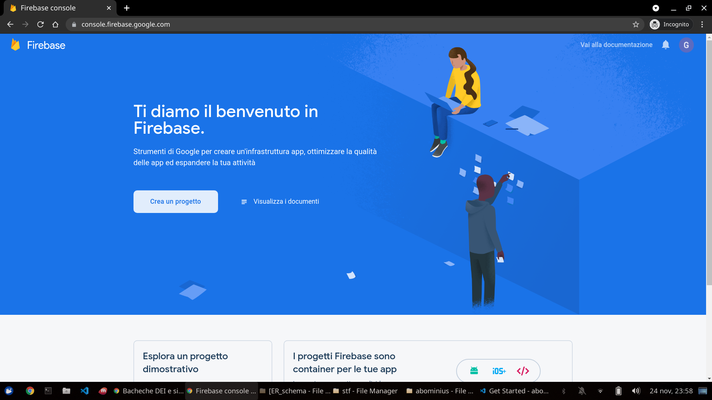
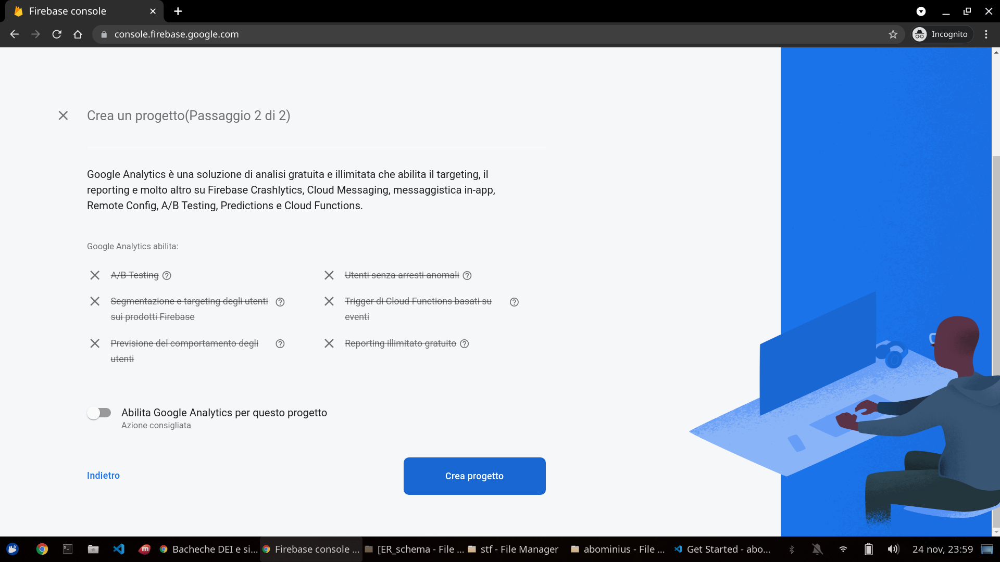
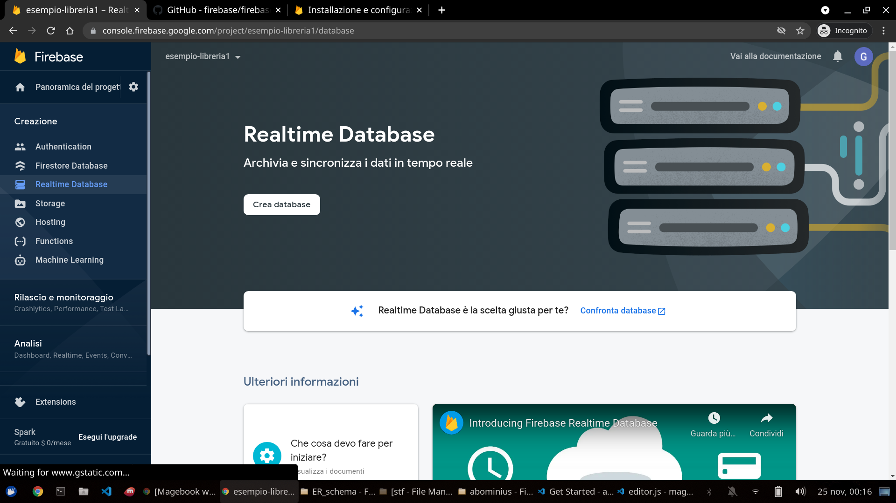
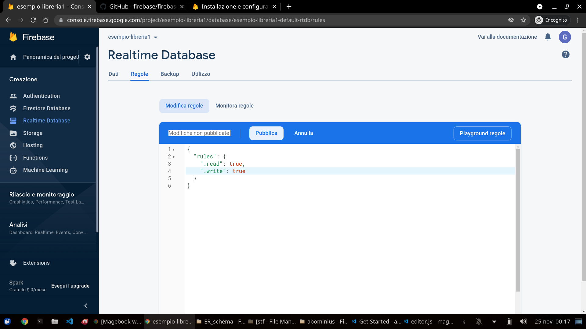
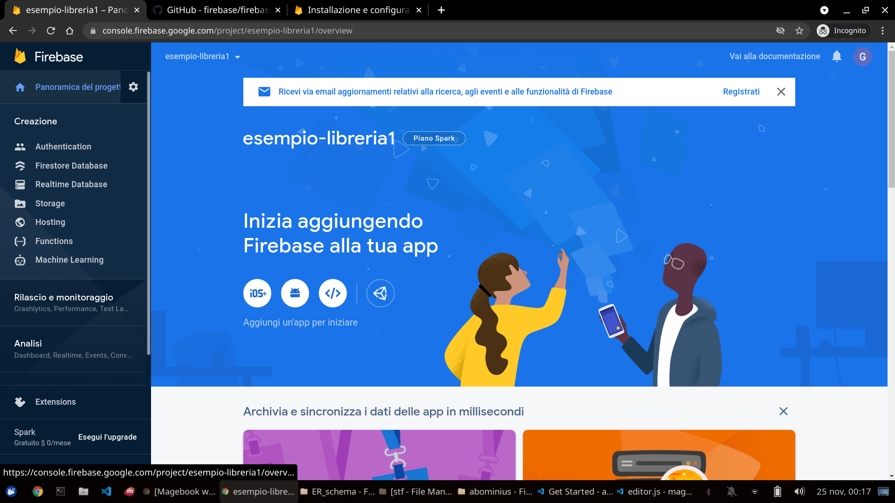
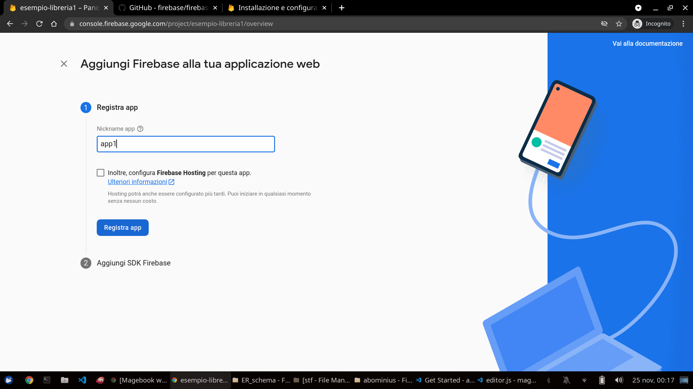
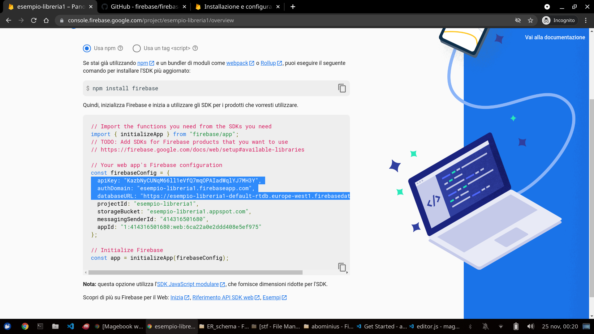
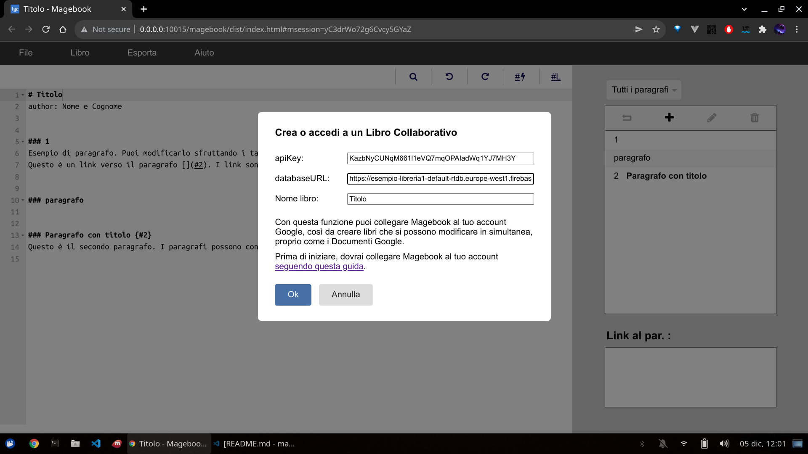

# Magebook

Magebook is a *gamebook* editor. *Gamebooks* are book where text is splitted in numbered chapters. Chapters end with link to other chapters. Readers should not read from the first to the latter chapter, but jump following the links based on their choices.

Esempio:
```markdown
# Book title
author: Author's Name

### 1
Where do you want to go? [Right 2](#2) or [left 3](#3)?

### 2
You have turned right.

### 3
You have turned left.
```
Magebook will help you write your *gamebook* with a series of specific features.


# Download
Magebook is a [web app](https://librogamesland.github.io/magebook/editor/) and you need to use the web app version to use online features like collaborative editing.

Yet, you may download Magebook to work easily with local files (choose your operative system):
- [Windows](https://librogamesland.github.io/magebook/dist/magebook-windows.exe)
- [Linux](https://librogamesland.github.io/magebook/dist/magebook-linux)
- [MacOs](https://librogamesland.github.io/magebook/dist/magebook-macos)

*WARNING*: Magebook requires either Google Chrome or Microsoft Edge installed on your system in order to work.

# Common features

Magebook book are written in Markdown format. Magebook may also read and write LibroGameCreator3 files.

Every book starts with a title and some properties, and include a set of chapters:

```markdown
# Titolo del libro
author: INSERT YOUR NAME HERE
... other properties ...

### 1
This is the first chapter. Chapters' titles usually are number. You may use words too, like:


### Rules
Create a link between chapters with [Link text](#chapter). When there's no link text, Magebook will insert it automatically. For example: [](#Rules) is the same as [Rules](#Rules). You may also use longer chapter titles. For example:

### Chapter with a really long title {#3}
Now writing [](#3) is the same as  [Chapter with a really long title](#3).

You may use stars to write *italic text* and double starts to write **bold text**.
```

Top navbar includes functions to save, load and create new files, or export books in Word or LibreOffice/OpenOffice formats. The "Book" options in the top navbar includes functions to generate book graph and shuffle chapters.

Under the top navbar, you may see the current chapter title and:
- find words
- undo/redo edits
- insert and empty link or a link the the first avaible chapter.

The side menu includes functions to create, edit, delete and navigate easily between chapters. You may also see which chapters links to the current one.

# Progetti collaborativi

You may use Magebook to work on collaborative projects. Those projects che possono essere modificati da più dispositivi contemporaneamente, con le modifiche sincronizzate in tempo reale. Grazie a questa funzionalità è possibile collegare a Magebook il proprio account Google attraverso Google Firebase, che è gratuito fino a 1GB di memoria (circa 500 librogame completi).

## Abilita e collega il tuo account Google

La procedura è un po' complicata e richiede qualche minuto, ma una volta completata la prima volta, non sarà più necessario ripeterla per i libri successivi.

Go to <https://console.firebase.google.com/>, login with Google and create a new project. Choose the name you want (its the same). You do not need to enable Google Analytics.





Una volta creato il progetto, cerca nel menu laterale a sinistra "Realtime Database" e quindi premi il tasto "Create Database". Scegli la zona più vicina a te e "Avvia in modalità di blocco".





Nella schermata che si apre, seleziona regole. Rimuovi le regole presenti e sostituiscile con:
```javascript
{
  "rules": {
    "$secret": {
      ".read": true,
      ".write": true 
    }
  }
}
```

Ci siamo quasi. Dal menu laterale a sinistra, clicca su "Panoramica del progetto".




Sotto a "Inizia aggiungendo Firebase alla tua app" c'è un pulsante con il simbolo `</>` (web). Cliccalo. Scegli il nickname che preferisci (non è importante) e clicca su "Registra app".





A questo punto, dovresti vedere una serie di codici di autorizzazione, fra cui `apiKey` e `databaseURL`. Questi sono i valori che vanno copiaincollati all'interno di Magebook. Nell'esempio della figura qui sotto i due valori sono rispettivamente `KazbNyCUNqM661l1eVQ7mqOPAIadWq1YJ7MH3Y` e `https://esempio-libreria1-default-rtdb.europe-west1.firebasedatabase.app`



Apri Magebook, dalla barra di navigazione in alto seleziona `File -> Nuovo Collaborativo`. Inserisci `apiKey` e `databaseURL` e scegli un nome per il libro. Il nome deve essere univoco: è molto importante perché identificherà il tuo libro, fungendo quindi anche da password.

Una volta terminato, verrai portato a una pagina di Magebook con il nuovo libro. Salva l'URL della pagina fra i segnalibri (così da poterlo ritrovare in seguito) e condividilo con chi vuoi.

Fatto!


# Export to Word/LibreOffice

You may customize Magebook export Word/LibreOffice files, adding options, like so.

**(Still work in progress!)**

Ad esempio, è possibile:
```markdown
# Titolo Libro
author: Nome e Cognome
export-heading-style: inline

### 1
... testo paragrafo ...
```


# Trasforma il tuo libro in un'app

**(Still work in progress!)**

Magebook book may be used a starting point for [hybrid apps](#https://ionic.io/), that may be distributed as web apps or Android apps and Ios apps.


# Licenza e autori
Magebook è un software gratuito e open-source (licenza MIT) sviluppato da **Luca Fabbian** <luca.fabbian.1999@gmail.com>, con il supporto della community di [Librogame's Land](http://librogame.net).

Il progetto nasce come versione browser di [LibroGameCreator 3](http://www.matteoporopat.com/librogame/libro-game-creator-3/).