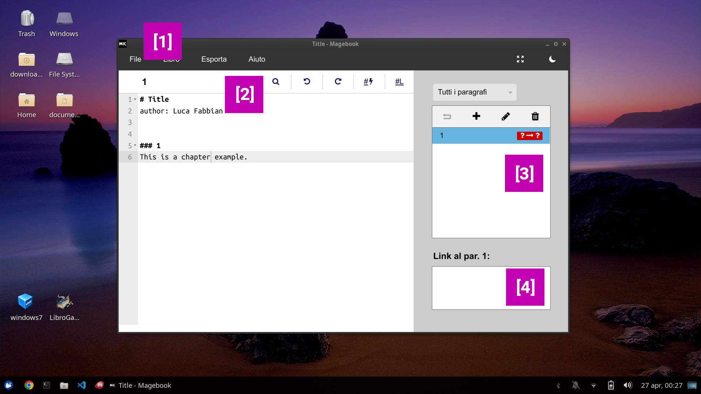

# Magebook

Magebook is a *gamebook* editor. *Gamebooks* are books where text is splitted in numbered chapters. Each chapter ends with links to other chapters. Readers should not read from the first to the latter chapter, but jump through the links as they wish.  
Here is an example of a three chapters gamebook:

```markdown
# Book title
author: Name Surname

### 1
Where do you want to go? [Right 2](#2) or [left 3](#3)?

### 2
You have turned right.

### 3
You have turned left.
```
Magebook will help you write your *gamebook* with a set of specific features. Magebook files may be converted into Word/OpenOffice files, but also be used to generate [ebooks](#export-as-ebook-epub-azw3) or [Android/Ios apps](#generate-an-app-from-your-book). Moreover, with the [collaborative mode](#collaborative-projects), you may edit book with other users at the same time.


# Download
Magebook is a [web app](https://librogamesland.github.io/magebook/editor/) - you don't have to download it, just open <https://librogamesland.github.io/magebook/editor>:

<a class="button" target="_blank" href="https://librogamesland.github.io/magebook/editor">Open Magebook</a>


Magebook works with Chrome, Firefox, Safari (?) and Edge, other than Android and Ios smartphones.  
Offline mode is supported too - you do not need an internet connection again after opening the web page for the first time.

# Features



The top navbar `[1]` allows to load save and create new files, or to export the book into a Word/LibreOffice/OpenOffice/HTML file. The "Book" menu lets you see the book's graph and to shuffle chapters.

Below the navbar, you should see the current chapter name/number and five buttons `[2]`, useful to:
- find words
- undo/redo edits
- insert an empty link (Ctrl+L) or a link to the first avaible chapter (Ctrl+K).

The sidemenu `[3]` allows to add/edit/delete chapters and move between them. Below `[4]` you may check the list of chapters linking to the current one.

# Book format

Magebook's books are written in Markdown format. 
- new chapters starts with three hashes and a number `### number`. It's recommended to use numbers to label chapters, but you may use words too, like `### Rules`
- chapters may also have a title different from the number `### Chapter with a really long title {#number}`
- to insert a link to a chapter, type `[number]` or, `[Text of the link](#number)`. Working links will be highlighted in blue, while orphan links are highlighted in red.


- you may also add `**bold**`, `*italic*`, `<b>bold</b>`, `<i>italic</i>`, `<u>underline</u>` text
- add meta text (will not be inserted in exported files) with <code>&#96;comment&#96;</code>, for example <code>&#96;TODO: I need to revision this chapter&#96;</code>
- each chapter belongs to a group when it's labelled with `[group]:<> ("Group name")`. The right sidemenu allows to filter chapters by group. Moreover, you may choose to shuffle just a group instead of the entire book.
- `![][flag-death]`, `![][flag-final]`, `![][flag-fixed]` allows to add a flag to a chapter, so that they will be highlighted in the right sidemenu. 


Books may also have some metadata at the beginning of the document:
- a title, inserted with `# Title`
- a list of [properties](#properties), declared as `property: value`. For example, if you want to disable the short link format (i.e. `[number]`), you have to add `disableShortLinks: true`


Here is a complete example:
```markdown
# Book title
author: Name Surname
disableShortLinks: false


### 1
This is the first chapter.


### Rules
Per creare un link si usa il formato [Testo del link](#paragrafo). Se il testo è assente, Magebook lo inserirà in automatico. Ad esempio [](#Regole) equivale a [Regole](#Regole). Si possono generare anche nomi più brevi per i paragrafi, ad esempio:

### Chapter with a really long title {#3}
Here, write [](#3) is the same as [Paragrafo con titolo molto lungo](#3).

Using stars you may insert *italic text* and **bold text**.
```


# Properties

### Common:
- `disableShortLinks: true` disable the `[number]` link format, allowing just `(Text)[#number]`

### Formatting Word/OpenOffice/LibreOffice/... files:

#### page
**→ `page: width height, marginTop marginRight marginBottom marginLeft`**

Set the page dimensions and margins (in centimeters). Instead of width/height, you may use *A3*, *A4*, *A5*, *A6*, *B4*, *B5*, *B6* or *Letter*.

- `page: A5, 2.5 2 2 2` *(default value)* standard format of the ["I Corti di Librogame's Land"](https://librogamesland.github.io/corti) award. A5 page with a top margin of 2.5cm, and other margin of 2cm.
- `page: 20 20, 3 3 3 3` square page 20cm x 20cm with 3cm of margin everywhere.


#### textFont
**→ `textFont: font, size, lineSpacing`**

Set the main text font. Size is in points (pt), the standard unit of measure of typography. Linespacing may be either fixed or a percentage (add `%` at the end).

- `textFont: Times New Roman, 12, 115%` *(default value)* standard format of the ["I Corti di Librogame's Land"](https://librogamesland.github.io/corti) award. Line spacing is proportional 1.15
- `textFont: EB Garamond, 13, 100%` standard format of the ["Corti in gioco"](https://www.lospaziobianco.it/lonework/corti-in-gioco-concorso-per-autori-di-librogame/) award. Line spacing is Single

#### titleFont
→ **`titleFont: font, size, lineSpacing`**

Same as above, just for the chapter' titles.


#### titleStyle
→ **`titleStyle: style`**

Change the chapter title style. Avaible styles are:
- `titleStyle: default` on a new line, centered
- `titleStyle: inline` same line, on the left 


### Link and titles renaming/overriding during export:

The options below let you change chapter keys/title/... on the fly while exporting.

You may use any javascript syntax. In javascript, you use `+` to concatenate strings, `'string'` to declare strings as they are and brackets `()` to force the operation order. There is also a special operator `condition ? valueIfTrue : valueIfFalse` that lets you check a condition and choose a different value if it's true or false.


#### renameTitle
Change the title. As default, this property is used to make chapters' titles bold (`<b></b>`).
- **book**: the entire book, indexed
- **chapter**: chapter 
- **title**: chapter title
- **key**: chapter key ("number")


- `renameTitle: '<b>' + (title == '' ? key : title) + '</b>'` *(default value)* if title is empty(`=''`), use the key, otherwise the title. In both cases, mark the title as bold. 
- `renameTitle: key` just use the key, and nothing else
- `renameTitle: key + '.'` add a period at the end


#### renameLink
Change the link to a chapter. For example, you may add square brackets `[]` to each link.
- **book**: the entire book, indexed
- **text**: the link text, if link is in the format `[text](#key)`
- **chapter**: the target chapter of the link (null if the target chapter does not exists)
- **title**: target chapter title (null if the target chapter does not exists)
- **key**: link key ("number")
- **currentChapter**: the current chapter

LINKS ARE NOT UNDERLINED BY DEFAULT! Add `'<u>' + ... + '</u>'` to add underline.


- `renameLink: text == '' ? (chapter == null ? 'ERROR' : (title == '' ? key : title)) : text` *(default value)* 
- `renameLink: '→ ' + key` add an arrow before each link
- `renameLink: '&#91;' + key + '&#93;'` add [ ] square brackets (I'm using [HTML codes](https://unicode-table.com/en/html-entities/) to avoid conflict with links)

#### renameAnchor
Change the chapter internal identifier (known as Bookmark in Word/Libreoffice). This may be useful to avoid identifier conflict if multiple files are merged togheter. For example, you may add a prefix.
- **book**: the entire book, indexed
- **key**: anchor key ("number")


- `renameAnchor: key` *(default value)* just use the key.
- `renameAnchor: 'mybook' + key` add the `mybook` prefix to each key


# Collaborative projects

You may use Magebook to work on collaborative projects. Those projects may be edited by multiple users, with real time synced changes. To a questa funzionalità è possibile collegare a Magebook il proprio account Google attraverso Google Firebase, che è gratuito fino a 1GB di memoria (circa 500 librogame completi).

## Link your Google account to Magebook

Set up may take some minutes, but once done, it won't be required again for later books.

Go to <https://console.firebase.google.com/>, login with Google and create a new project. Choose the name you want (it's irrelevant). You do not need to enable Google Analytics.


Once created a project, looks for "Realtime Database" in the left sidemenu. Click on "Create Database". Choose a city in the nearby and "Start in block mode".


In the next page, click on "Rules". Replace the rules with:
```javascript
{
  "rules": {
    "$secret": {
      ".read": true,
      ".write": true 
    }
  }
}
```

Almost done. Now, from the left sidemenu, click on  "Project overview".


Below the "Start by adding Firebase to your app" there is a `</>` button (web). Click it. Choose the nickname you wish (it's irrelevant) and click on "Register app".


At this point, you should see a set of auth codes, including `apiKey` and `databaseURL`. Those values should be copied and pasted Magebook. Nell'esempio della figura qui sotto i due valori sono rispettivamente `KazbNyCUNqM661l1eVQ7mqOPAIadWq1YJ7MH3Y` e `https://esempio-libreria1-default-rtdb.europe-west1.firebasedatabase.app`


Open Magebook, in the top navbar choose `File -> New Collaborative`. Insert the `apiKey` and `databaseURL` retrieved before and choose a name for your book. The name must be unique: it will identify your book forever.

Once done, it is strongly advise to save the page URL as a bookmark, to find it in the future and share to other users.

Done!


# Other formats

Here is a recap of how to use third party tools to `Export` into other formats.


### Export as PDF
The quickest way is to export into Word/LibreOffice. Then, you can just open the file with Word or Libreoffice and  `Save as`, choosing the PDF format.

### Export as ebook (.epub, .azw3)
Magebook exports into HTML files, which are fully compliant with [Calibre](https://calibre-ebook.com/download). You may download Calibre for free from <https://calibre-ebook.com/download>.

From Magebook, choose `Export -> Website (.html)`, then open Calibre. From Calibre choose `Add book` and then `Convert book`.  on the right. Kindle e-readers may read `.azw3` and `.mobi` formats, while other e-readers may read the `.epub` one.

WARNING! Calibre identifies the heading exported by Magebook, but some Calibre releases limit to 50 chapters by default. You may change this behaviour while converting the book, under *"Table of contents"*.


### Generate an app from your book

***WORK IN PROGRESS - WILL BE RELEASED SHORTLY***

Books written with Magebook may be used to generate [hybrid apps](https://ionic.io/), which may be distributed as web apps or Android/Ios apps.

# Changelog
#### 1.0
First release.

#### 1.1
Added short link format `[number]` and property `disableShortLinks: true`.

Links to broken chapters are highlighted in the right menu.

GUI restyle.

Export as website.

Fixes.

#### 1.2

Major internal rewrite.

The editor is now powered by Codemirror6 instead of Ace. It should be prettier and more mobile friendly.

Now "Latest sessions" keeps a record of collaborative projects too.

New export properties (page, textFont, renameLinks, ...)


# License and authors
Magebook it's a free and open-source (MIT licensed) software, developed by **Luca Fabbian** <luca.fabbian.1999@gmail.com>, with the support of the [Librogame's Land](http://librogame.net) community.

The project started as a web version of [LibroGameCreator 3](http://www.matteoporopat.com/librogame/libro-game-creator-3/).