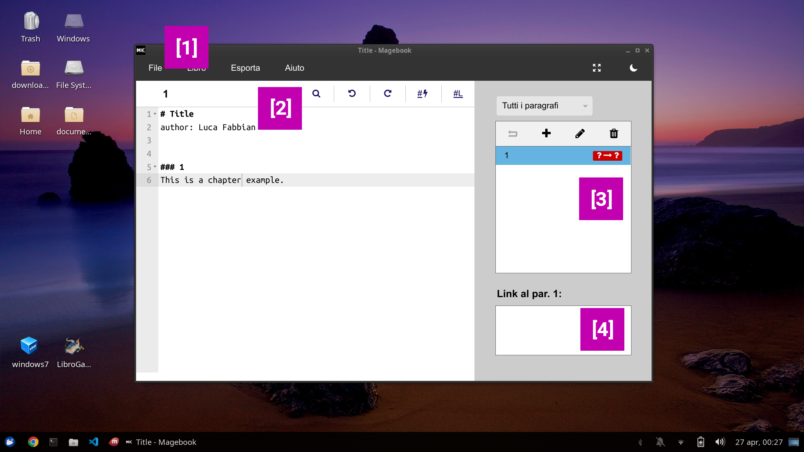

# Magebook

Magebook è un editor per *librogame*, cioè testi divisi in paragrafi numerati. A fine di ogni paragrafo ci sono link verso altri paragrafi. Il lettore non deve quindi leggere dall'inizio alla fine del libro, ma saltare da un paragrafo all'altro in base alle proprie scelte.  
Ad esempio, questo è un *librogame* con tre paragrafi:

```markdown
# Titolo libro
author: Nome Autore

### 1
Dove vuoi andare? [A destra 2](#2) o [a sinistra 3](#3)?

### 2
Sei andato a destra.

### 3
Sei andato a sinistra.
```
Magebook ti aiuterà a scrivere il tuo *librogame* con una serie di funzioni pensate apposta per il genere. I libri scritti con Magebook possono essere convertiti in file Word/, ma anche usati per generare [ebook](#esporta-come-ebook-epub-azw3) o [app Android/Ios](#trasforma-il-libro-in-app). Inoltre, usando la [modalità collaborativa](#progetti-collaborativi), è possibile scrivere un libro a quattro mani, lavorando allo stesso file da dispositivi diversi.


# Download
Magebook è un programma web - non devi scaricarlo, ti basta andare sul sito <https://librogamesland.github.io/magebook/editor>:

<a class="button" target="_blank" href="https://librogamesland.github.io/magebook/editor">Apri Magebook</a>


Magebook è compatibile con Chrome, Firefox, Safari e Edge, e funziona anche su cellulari Android e Ios.  
Il sito ha il pieno supporto per la modalità offline - una volta aperto per la prima volta, funzionerà anche in assenza di connessione.

# Funzionalità base



La barra in alto `[1]` consente di caricare, salvare e creare nuovi file, o esportare il libro in formato Word/LibreOffice/OpenOffice/HTML/... La voce "Libro" nella barra in alto consente di visualizzare un grafo del libro e di rimescolare i paragrafi.

Appena sotto la barra in alto sono visualizzati il nome del paragrafo corrente e cinque pulsanti `[2]`, per:
- cercare parole nel testo
- annullare/ripristinare le modifiche al testo
- inserire un link vuoto (Ctrl+L) o un link al primo paragrafo disponibile (Ctrl+K).

Il menu laterale `[3]` consente di creare, modificare, eliminare e navigare con agilità fra i paragrafi. In basso `[4]` sono visualizzati i paragrafi che hanno un link al paragrafo attuale.

# Formato

I libri di Magebook sono scritti in formato Markdown.
- Usa tre cancelletti e un numero `### numero` per dichiarare un paragrafo. È consigliato utilizzare numeri per identificare i paragrafi, ma Magebook è in grado di gestire anche parole generiche, ad esempio `### Regole`
- Usa `### Titolo del paragrafo molto lungo {#numero}` per dichiarare un paragrafo con un titolo diverso dal numero.
- Per creare un link, usa `[numero]` o, in alternativa, `[Testo del link](#numero)`. I link corretti sono visualizzati in blu, i link a paragrafi inesistenti sono visualizzati in rosso.


- Puoi anche inserire testo in `**grassetto**`, `*corsivo*`, `<b>grassetto</b>`, `<i>corsivo</i>`, `<u>sottolineato</u>`
- Aggiungi annotazioni/commenti che non verranno esportati con <code>&#96;Annotazione&#96;</code>, ad esempio <code>&#96;TODO: devo scrivere un paragrafo&#96;</code>
- Ogni paragrafo può avere un gruppo specificato con `[group]:<> ("Nome del gruppo")`. Il menu a destra consente di visualizzare i paragrafi filtrandoli per gruppo; inoltre, quando rimescoli puoi limitarti a un solo gruppo.
- `![][flag-death]`, `![][flag-final]`, `![][flag-fixed]` consentono di aggiungere un marchio al paragrafo. I paragrafi marchiati avranno un simbolo nel menù laterale a destra, in questo modo potrai riconoscerli a colpo d'occhio.


Prima dei paragrafi, ogni libro può avere:
- Un titolo dichiarato con `# Titolo libro`
- Una serie di [opzioni](#opzioni) `opzione: valore`, ad esempio per disabilitare il riconoscimento dei link corti (cioè `[numero]`), puoi aggiungere l'opzione `disableShortLinks: true`


Ecco un esempio completo:
```markdown
# Titolo del libro
author: Nome Cognome
disableShortLinks: false


### 1
Questo è il primo paragrafo. Di solito si usano i numeri per identificare i paragrafi, ma è si possono usare anche parole, ad esempio:


### Regole
Per creare un link si usa il formato [Testo del link](#paragrafo). Se il testo è assente, Magebook lo inserirà in automatico. Ad esempio [](#Regole) equivale a [Regole](#Regole). Si possono generare anche nomi più brevi per i paragrafi, ad esempio:

### Paragrafo con titolo molto lungo {#3}
In questo caso, scrivere [](#3) equivale a [Paragrafo con titolo molto lungo](#3).

Usando gli asterischi si può inserire anche *testo in corsivo* e doppi asterischi per **testo in grassetto**.
```


# Opzioni

**Generali:** 
- `disableShortLinks: true` disabilita i link `[numero]`, lasciando attivo solo il formato esteso `(Testo)[#numero]`

**Esportazione Word/OpenOffice/LibreOffice:**  
Queste opzioni controllano l'aspetto del file ottenuto quando esporti il libro

***WORK IN PROGRESS - FUNZIONE PREVISTA PER IL FUTURO***
- `exportPage: `
- `exportTextFont: `


**Manipolazione nomi di link e paragrafi:**  
Magebook consente di intervenire sui nomi di link e paragrafi durante l'esportazione. Ad esempio, puoi aggiungere in automatico una freccia prima di ogni link, o rendere tutti i titoli in corsivo.

***WORK IN PROGRESS - FUNZIONE PREVISTA PER IL FUTURO***


# Progetti collaborativi

Magebook consente anche di lavorare su progetti condivisi, che possono essere modificati da più dispositivi contemporaneamente, con le modifiche sincronizzate in tempo reale. Per usare questa funzione è necessario collegare a Magebook il proprio account Google attraverso il servizio Google Firebase, che è gratuito fino a 1GB di memoria (circa 500 librogame completi).

### Abilita e collega il tuo account Google

La procedura è un po' complicata e richiede qualche minuto, ma una volta completata la prima volta, non sarà più necessario ripeterla per i libri successivi.

Vai su <https://console.firebase.google.com/>, fai il login con google e crea un nuovo progetto. Dai il nome che preferisci (non è importante). Non serve abilitare Google Analytics.


Una volta creato il progetto, cerca nel menu laterale a sinistra "Realtime Database" e quindi premi il tasto "Create Database". Scegli la zona più vicina a te e "Avvia in modalità di blocco".


Nella schermata che si apre, seleziona regole. Rimuovi le regole presenti e sostituiscile con:
```javascript
{
  "rules": {
    "$secret": {
      ".read": true,
      ".write": true 
    }
  }
}
```

Ci siamo quasi. Dal menu laterale a sinistra, clicca su "Panoramica del progetto".


Sotto a "Inizia aggiungendo Firebase alla tua app" c'è un pulsante con il simbolo `</>` (web). Cliccalo. Scegli il nickname che preferisci (non è importante) e clicca su "Registra app".


A questo punto, dovresti vedere una serie di codici di autorizzazione, fra cui `apiKey` e `databaseURL`. Questi sono i valori che vanno copiaincollati all'interno di Magebook. Nell'esempio della figura qui sotto i due valori sono rispettivamente `KazbNyCUNqM661l1eVQ7mqOPAIadWq1YJ7MH3Y` e `https://esempio-libreria1-default-rtdb.europe-west1.firebasedatabase.app`


Apri Magebook, dalla barra di navigazione in alto seleziona `File -> Nuovo Collaborativo`. Inserisci `apiKey` e `databaseURL` e scegli un nome per il libro. Il nome deve essere univoco: è molto importante perché identificherà il tuo libro, fungendo quindi anche da password.

Una volta terminato, verrai portato a una pagina di Magebook con il nuovo libro. Salva l'URL della pagina fra i segnalibri (così da poterlo ritrovare in seguito) e condividilo con chi vuoi.

Fatto!


# Altri formati

Oltre ai formati presenti nel menù `Esporta`, esistono numerosi altri strumenti  


### Esporta in PDF
Il metodo più veloce è esportare il file come Word/LibreOffice. A questo punto è possibile aprire il file con Word o LibreOffice e usare la funzione `Salva con nome`, selezionando il formato PDF.

### Esporta come ebook (.epub, .azw3)
I file HTML esportati da Magebook possono essere convertiti così come sono usando il programma [Calibre](https://calibre-ebook.com/download), scaricabile gratuitamente da <https://calibre-ebook.com/download>.

Da Magebook, seleziona `Esporta -> Sito web (.html)`, quindi apri Calibre. Da Calibre seleziona `Aggiungi libro` e poi `Converti libro`. Sarà possibile scegliere il formato dal menù a tendina in alto a destra. I lettori Kindle sono compatibile con i formati `.azw3` e `.mobi`, mentre per gli altri lettori è necessario scegliere `.epub`.

ATTENZIONE! Calibre riconosce in automatico il sommario esportato da Magebook, ma in alcune versioni si limita ai primi 50 paragrafi. Per cambiare questa opzione, durante l'esportazione seleziona *"Tabella dei contenuti"*.


### Trasforma il libro in app

***WORK IN PROGRESS - FUNZIONE PREVISTA PER IL FUTURO***

I libri che scrivi con Magebook potranno essere usati come base per creare [app ibride](https://ionic.io/), che possono essere distribute come app web o su Android o Ios.

# Versioni
#### 1.0
Versione iniziale.

#### 1.1
Aggiunto formato link corto `[numero]` e opzione `disableShortLinks: true`.

I link a paragrafi inesistenti vengono segnalati nel menu laterale.

Restyle dell'interfaccia.

Aggiunta esportazione sito web.

Correzioni varie.

# Licenza e autori
Magebook è un software gratuito e open-source (licenza MIT) sviluppato da **Luca Fabbian** <luca.fabbian.1999@gmail.com>, con il supporto della community di [Librogame's Land](http://librogame.net).

Il progetto nasce come versione browser di [LibroGameCreator 3](http://www.matteoporopat.com/librogame/libro-game-creator-3/).