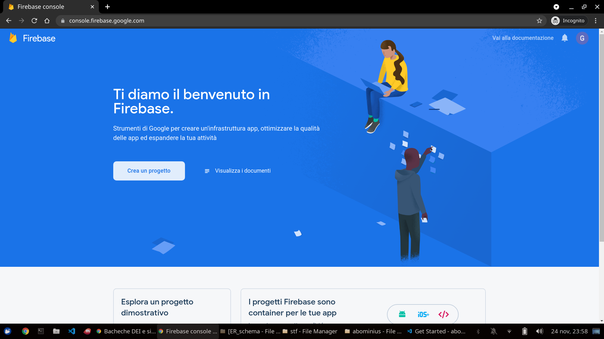
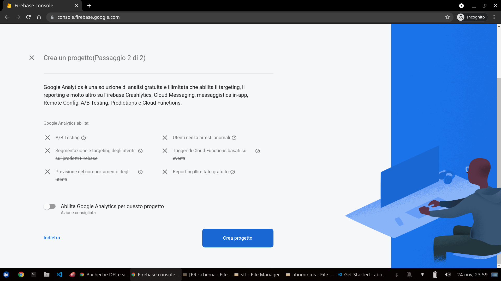
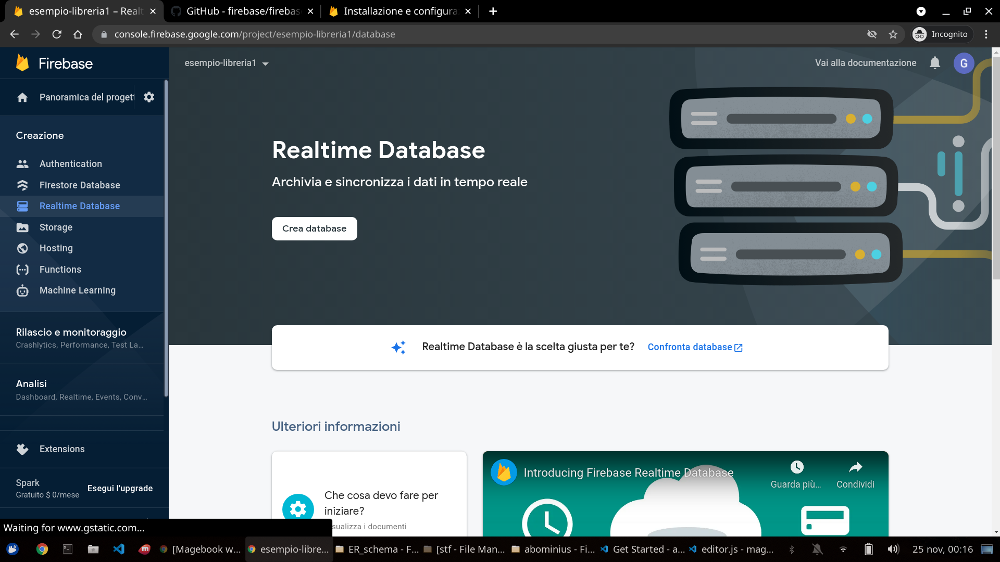
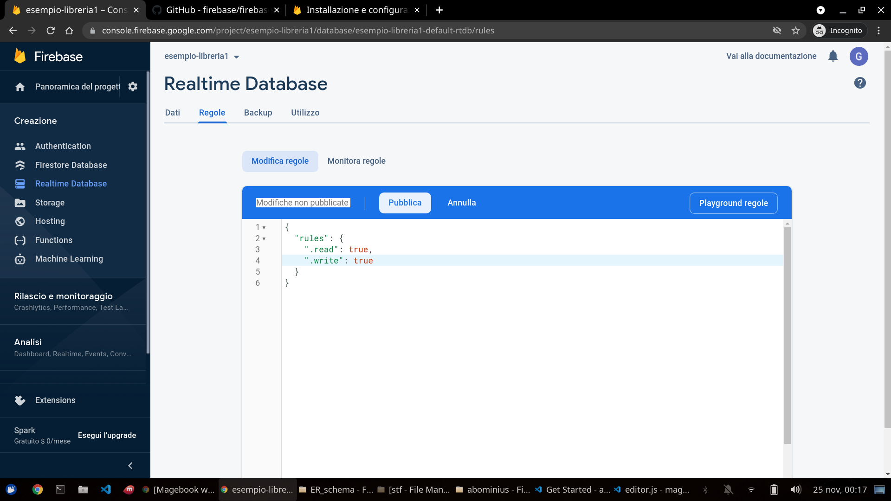
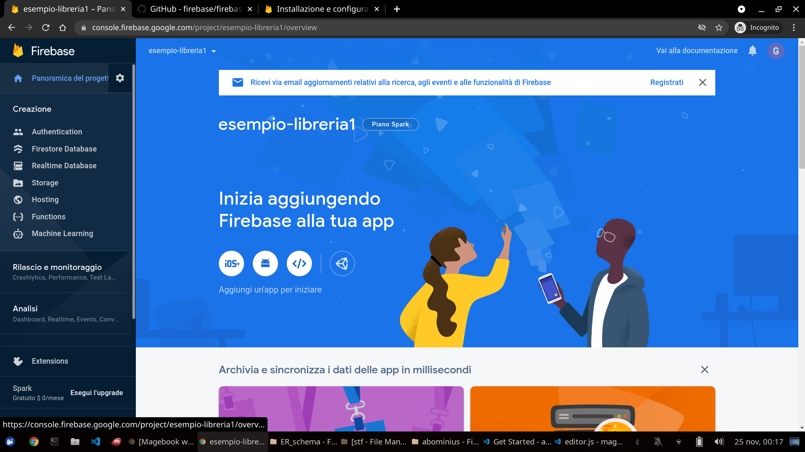
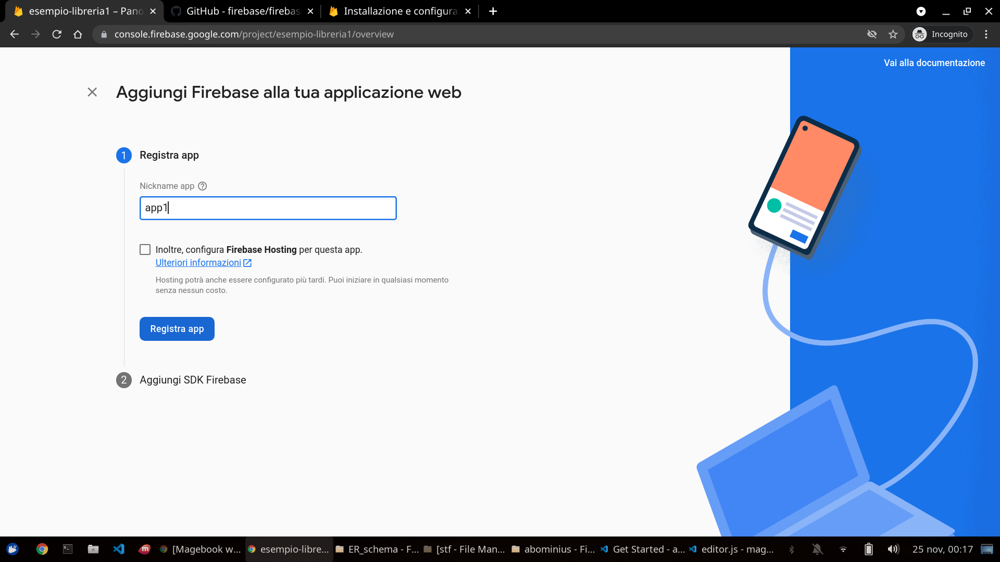
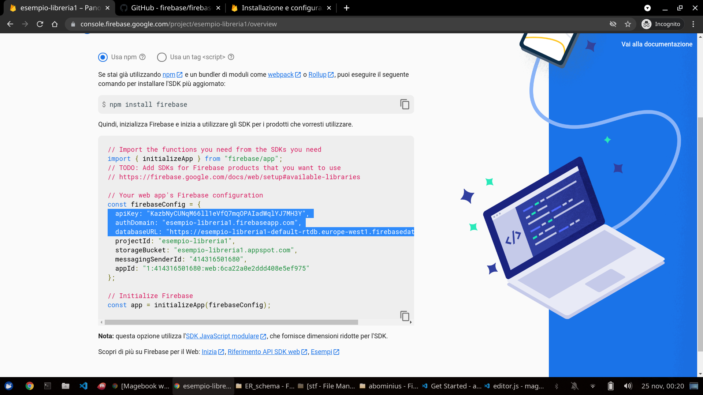
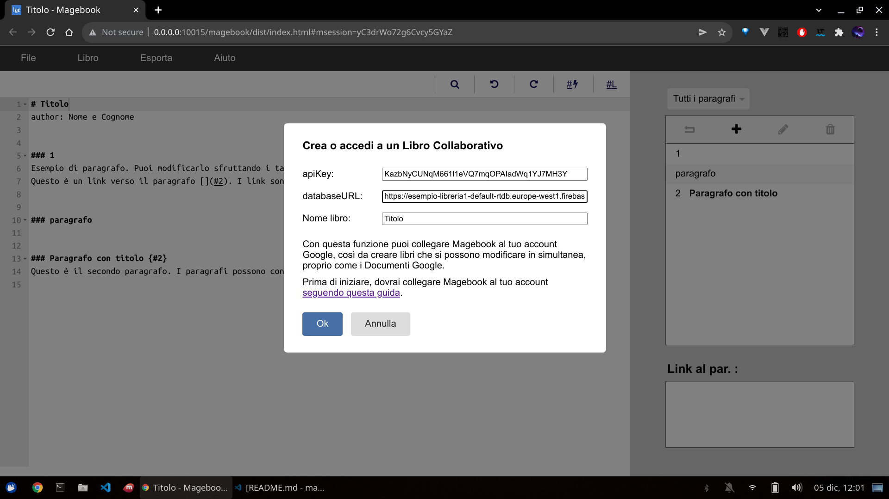

# Magebook

Magebook è un editor per *librogame*, cioè testi divisi in paragrafi numerati. A fine di ogni paragrafo ci sono link verso gli altri paragrafi. Il lettore non deve quindi leggere dall'inizio alla fine, ma saltare 


Esempio:
```markdown
# Titolo libro
author: Nome Autore


### 1
Dove vuoi andare? [A destra 2](#2) o [a sinistra 3](#3)?


### 2
Sei andato a destra.


### 3
Sei andato a sinistra.
```
Magebook ti aiuterà a scrivere il tuo *librogame* con una serie di funzioni pensate pensate apposta per il genere.


# Progetti collaborativi

Non solo Magebook consente di lavorare su file locali, ma si può anche usare per progetti condivisi, che possono essere modificati da più dispositivi contemporaneamente, con le modifiche sincronizzate in tempo reale. Grazie a questa funzionalità è possibile collegare a Magebook il proprio account Google attraverso Google Firebase, che è gratuito fino a 1GB di memoria (circa 500 librogame completi).

## Abilita e collega il tuo account Google

La procedura è un po' complicata e richiede qualche minuto, ma una volta completata la prima volta, non sarà più necessario ripeterla per i libri successivi.

Vai su <https://console.firebase.google.com/>, fai il login con google e crea un nuovo progetto. Dai il nome che preferisci (non è importante). Non serve abilitare Google Analytics.





Una volta creato il progetto, cerca nel menu laterale a sinistra "Realtime Database" e quindi premi il tasto "Create Database". Scegli la zona più vicina a te e "Avvia in modalità di blocco".





Nella schermata che si apre, seleziona regole. Rimuovi le regole presenti e sostituiscile con:
```javascript
{
  "rules": {
    "$secret": {
      ".read": true,
      ".write": true 
    }
  }
}
```

Ci siamo quasi. Dal menu laterale a sinistra, clicca su "Panoramica del progetto".




Sotto a "Inizia aggiungendo Firebase alla tua app" c'è un pulsante con il simbolo `</>` (web). Cliccalo. Scegli il nickname che preferisci (non è importante) e clicca su "Registra app".





A questo punto, dovresti vedere una serie di codici di autorizzazione, fra cui `apiKey` e `databaseURL`. Questi sono i valori che vanno copiaincollati all'interno di Magebook. Nell'esempio della figura qui sotto i due valori sono rispettivamente `KazbNyCUNqM661l1eVQ7mqOPAIadWq1YJ7MH3Y` e `https://esempio-libreria1-default-rtdb.europe-west1.firebasedatabase.app`



Apri Magebook, dalla barra di navigazione in alto seleziona `File -> Nuovo Collaborativo`. Inserisci `apiKey` e `databaseURL` e scegli un nome per il libro. Il nome deve essere univoco: è molto importante perché identificherà il tuo libro, fungendo quindi anche da password.

Una volta terminato, verrai portato a una pagina di Magebook con il nuovo libro. Salva l'URL della pagina fra i segnalibri (così da poterlo ritrovare in seguito) e condividilo con chi vuoi.

Fatto!


# Licenza e autori
Magebook è un software gratuito e open-source (licenza MIT) sviluppato da Luca Fabbian <luca.fabbian.1999@gmail.com>, con il supporto della community di [Librogame's Land](http://librogame.net).

Il progetto nasce come versione browser di [LibroGameCreator 3](http://www.matteoporopat.com/librogame/libro-game-creator-3/).